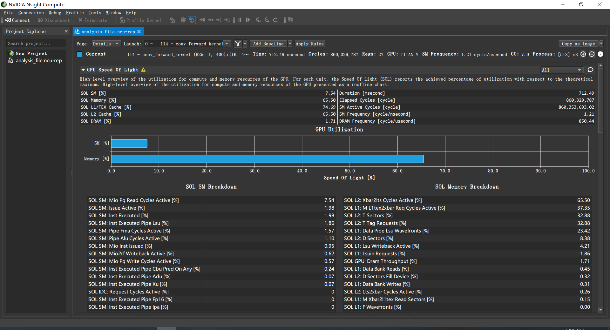

# Final Report

- Names: Wenqing Luo, Feiyu Zhang, Xiaomeng Yang
- NetID: wenqing.17, feiyu.17, xiaomeng.17
- School Affiliation: ZJUI

## Milestone 2

### Show output of rai running Mini-DNN on the CPU (CPU convolution implemented) for batch size of 10k images
```
Dynamic Rate Limit: 30s
✱ Checking your authentication credentials.
✱ Preparing your project directory for upload.
✱ Uploading your project directory. This may take a few minutes.
 55.65 KiB / 55.65 KiB ┃▓▓▓▓▓▓▓▓▓▓▓▓▓▓▓▓▓▓▓▓▓▓▓▓▓▓▓▓▓▓▓▓▓▓▓▓▓▓▓▓▓▓▓▓▓▓▓▓▓▓▓▓▓▓▓▓▓▓▓▓▓▓▓▓▓▓▓▓▓▓▓▓▓▓▓▓▓▓▓▓▓▓▓▓▓▓▓▓▓▓▓▓▓▓▓▓▓▓▓▓▓▓▓▓▓▓▓┃ 100.00% 60.68 KiB/s 0s
✱ Folder uploaded. Server is now processing your submission.
✱ Your job request has been posted to the queue.
✱ Server has accepted your job submission and started to configure the container.
✱ Downloading your code.
✱ Using illinoisimpact/ece408_minidnn_docker:amd64-gpu-cu10.2-fa20 as container image.
✱ Starting container.
✱ Running /bin/bash -c "mkdir /build/student_code && cp -rv /src/* /build/student_code"
'/src/custom' -> '/build/student_code/custom'
'/src/custom/cpu-new-forward.cc' -> '/build/student_code/custom/cpu-new-forward.cc'
'/src/custom/cpu-new-forward.h' -> '/build/student_code/custom/cpu-new-forward.h'
'/src/custom/gpu-new-forward.h' -> '/build/student_code/custom/gpu-new-forward.h'
'/src/custom/new-forward.cu' -> '/build/student_code/custom/new-forward.cu'
'/src/final.cc' -> '/build/student_code/final.cc'
'/src/m2.cc' -> '/build/student_code/m2.cc'
'/src/m3.cc' -> '/build/student_code/m3.cc'
'/src/m4.cc' -> '/build/student_code/m4.cc'
'/src/rai_build.yml' -> '/build/student_code/rai_build.yml'
'/src/readme.md' -> '/build/student_code/readme.md'
'/src/report.md' -> '/build/student_code/report.md'
'/src/report.pdf' -> '/build/student_code/report.pdf'
✱ Running /bin/bash -c "cp /ece408/project/build/weights-86.bin /build"
✱ Running /bin/bash -c "cp -rv /src/custom/* /ece408/project/src/layer/custom"
'/src/custom/cpu-new-forward.cc' -> '/ece408/project/src/layer/custom/cpu-new-forward.cc'
'/src/custom/cpu-new-forward.h' -> '/ece408/project/src/layer/custom/cpu-new-forward.h'
'/src/custom/gpu-new-forward.h' -> '/ece408/project/src/layer/custom/gpu-new-forward.h'
'/src/custom/new-forward.cu' -> '/ece408/project/src/layer/custom/new-forward.cu'
✱ Running /bin/bash -c "cmake /ece408/project/ && make -j8"
-- The C compiler identification is GNU 7.5.0
-- The CXX compiler identification is GNU 7.5.0
-- Check for working C compiler: /usr/bin/cc
-- Check for working C compiler: /usr/bin/cc -- works
-- Detecting C compiler ABI info
-- Detecting C compiler ABI info - done
-- Detecting C compile features
-- Detecting C compile features - done
-- Check for working CXX compiler: /usr/bin/c++
-- Check for working CXX compiler: /usr/bin/c++ -- works
-- Detecting CXX compiler ABI info
-- Detecting CXX compiler ABI info - done
-- Detecting CXX compile features
-- Detecting CXX compile features - done
-- Looking for pthread.h
-- Looking for pthread.h - found
-- Looking for pthread_create
-- Looking for pthread_create - not found
-- Looking for pthread_create in pthreads
-- Looking for pthread_create in pthreads - not found
-- Looking for pthread_create in pthread
-- Looking for pthread_create in pthread - found
-- Found Threads: TRUE  
-- Found CUDA: /usr/local/cuda (found version "10.2")
-- Configuring done
-- Generating done
-- Build files have been written to: /build
Scanning dependencies of target ece408net
[  3%] Building NVCC (Device) object src/CMakeFiles/GpuConv.dir/layer/custom/GpuConv_generated_new-forward.cu.o
[  7%] Building CXX object CMakeFiles/ece408net.dir/ece408net.cc.o
[ 10%] Linking CXX static library libece408net.a
[ 10%] Built target ece408net
Scanning dependencies of target GpuConv
[ 14%] Linking CXX static library libGpuConv.a
[ 14%] Built target GpuConv
Scanning dependencies of target MiniDNNLib
[ 17%] Building CXX object src/CMakeFiles/MiniDNNLib.dir/layer/conv_cpu.cc.o
[ 21%] Building CXX object src/CMakeFiles/MiniDNNLib.dir/mnist.cc.o
[ 25%] Building CXX object src/CMakeFiles/MiniDNNLib.dir/layer/conv_cust.cc.o
[ 28%] Building CXX object src/CMakeFiles/MiniDNNLib.dir/layer/ave_pooling.cc.o
[ 32%] Building CXX object src/CMakeFiles/MiniDNNLib.dir/layer/fully_connected.cc.o
[ 35%] Building CXX object src/CMakeFiles/MiniDNNLib.dir/layer/max_pooling.cc.o
[ 39%] Building CXX object src/CMakeFiles/MiniDNNLib.dir/network.cc.o
[ 42%] Building CXX object src/CMakeFiles/MiniDNNLib.dir/layer/conv.cc.o
[ 46%] Building CXX object src/CMakeFiles/MiniDNNLib.dir/layer/relu.cc.o
[ 50%] Building CXX object src/CMakeFiles/MiniDNNLib.dir/layer/sigmoid.cc.o
[ 53%] Building CXX object src/CMakeFiles/MiniDNNLib.dir/layer/softmax.cc.o
[ 57%] Building CXX object src/CMakeFiles/MiniDNNLib.dir/loss/cross_entropy_loss.cc.o
[ 60%] Building CXX object src/CMakeFiles/MiniDNNLib.dir/loss/mse_loss.cc.o
[ 64%] Building CXX object src/CMakeFiles/MiniDNNLib.dir/optimizer/sgd.cc.o
[ 67%] Building CXX object src/CMakeFiles/MiniDNNLib.dir/layer/custom/cpu-new-forward.cc.o
[ 71%] Linking CXX static library libMiniDNNLib.a
[ 71%] Built target MiniDNNLib
Scanning dependencies of target m3
Scanning dependencies of target m4
Scanning dependencies of target m2
Scanning dependencies of target final
[ 75%] Building CXX object CMakeFiles/m4.dir/m4.cc.o
[ 78%] Building CXX object CMakeFiles/m2.dir/m2.cc.o
[ 82%] Building CXX object CMakeFiles/m3.dir/m3.cc.o
[ 85%] Building CXX object CMakeFiles/final.dir/final.cc.o
[ 89%] Linking CXX executable m4
[ 92%] Linking CXX executable final
[ 96%] Linking CXX executable m3
[100%] Linking CXX executable m2
[100%] Built target m4
[100%] Built target m2
[100%] Built target m3
[100%] Built target final
✱ Running /bin/bash -c "time ./m2 10000"
Test batch size: 10000
Loading fashion-mnist data...Done
Loading model...Done
Conv-CPU==
Op Time: 82221.3 ms
Conv-CPU==
Op Time: 239363 ms
Test Accuracy: 0.8714
real    6m54.935s
user    6m53.970s
sys     0m0.960s
✱ The build folder has been uploaded to http://s3.amazonaws.com/files.rai-project.com/userdata/build-5f8303935fb7936d7faf843b.tar.gz. The data will be present for only a short duration of time.
```

### List Op Times (CPU convolution implemented) for batch size of 10k images
```
Conv-CPU==
Op Time: 82221.3 ms
Conv-CPU==
Op Time: 239363 ms
```

### List whole program execution time (CPU convolution implemented) for batch size of 10k images
```
real    6m54.935s
user    6m53.970s
sys     0m0.960s
```

## Milestone 3

### Show output of rai running your GPU implementation of convolution
```
Dynamic Rate Limit: 30s
✱ Checking your authentication credentials.
✱ Preparing your project directory for upload.
✱ Uploading your project directory. This may take a few minutes.
 38.86 KiB / 38.86 KiB ┃▓▓▓▓▓▓▓▓▓▓▓▓▓▓▓▓▓▓▓▓▓▓▓▓▓▓▓▓▓▓▓▓▓▓▓▓▓▓▓▓▓▓▓▓▓▓▓▓▓▓▓▓▓▓▓▓▓▓▓▓▓▓▓▓▓▓▓▓▓▓▓▓▓▓▓▓▓▓▓▓▓▓▓▓▓▓▓▓▓▓▓▓▓▓▓▓▓▓▓▓▓▓┃ 100.00% 46.43 KiB/s 0s
✱ Folder uploaded. Server is now processing your submission.
✱ Your job request has been posted to the queue.
✱ Server has accepted your job submission and started to configure the container.
✱ Downloading your code.
✱ Using illinoisimpact/ece408_minidnn_docker:amd64-gpu-cu10.2-fa20 as container image.
✱ Starting container.
✱ Running /bin/bash -c "mkdir /build/student_code && cp -rv /src/* /build/student_code"
'/src/custom' -> '/build/student_code/custom'
'/src/custom/cpu-new-forward.cc' -> '/build/student_code/custom/cpu-new-forward.cc'
'/src/custom/cpu-new-forward.h' -> '/build/student_code/custom/cpu-new-forward.h'
'/src/custom/gpu-new-forward.h' -> '/build/student_code/custom/gpu-new-forward.h'
'/src/custom/new-forward.cu' -> '/build/student_code/custom/new-forward.cu'
'/src/final.cc' -> '/build/student_code/final.cc'
'/src/m2.cc' -> '/build/student_code/m2.cc'
'/src/m3.cc' -> '/build/student_code/m3.cc'
'/src/m4.cc' -> '/build/student_code/m4.cc'
'/src/rai_build.yml' -> '/build/student_code/rai_build.yml'
'/src/readme.md' -> '/build/student_code/readme.md'
'/src/report.md' -> '/build/student_code/report.md'
'/src/report.pdf' -> '/build/student_code/report.pdf'
✱ Running /bin/bash -c "cp /ece408/project/build/weights-86.bin /build"
✱ Running /bin/bash -c "cp -rv /src/custom/* /ece408/project/src/layer/custom"
'/src/custom/cpu-new-forward.cc' -> '/ece408/project/src/layer/custom/cpu-new-forward.cc'
'/src/custom/cpu-new-forward.h' -> '/ece408/project/src/layer/custom/cpu-new-forward.h'
'/src/custom/gpu-new-forward.h' -> '/ece408/project/src/layer/custom/gpu-new-forward.h'
'/src/custom/new-forward.cu' -> '/ece408/project/src/layer/custom/new-forward.cu'
✱ Running /bin/bash -c "cmake /ece408/project/ && make -j8"
-- The C compiler identification is GNU 7.5.0
-- The CXX compiler identification is GNU 7.5.0
-- Check for working C compiler: /usr/bin/cc
-- Check for working C compiler: /usr/bin/cc -- works
-- Detecting C compiler ABI info
-- Detecting C compiler ABI info - done
-- Detecting C compile features
-- Detecting C compile features - done
-- Check for working CXX compiler: /usr/bin/c++
-- Check for working CXX compiler: /usr/bin/c++ -- works
-- Detecting CXX compiler ABI info
-- Detecting CXX compiler ABI info - done
-- Detecting CXX compile features
-- Detecting CXX compile features - done
-- Looking for pthread.h
-- Looking for pthread.h - found
-- Looking for pthread_create
-- Looking for pthread_create - not found
-- Looking for pthread_create in pthreads
-- Looking for pthread_create in pthreads - not found
-- Looking for pthread_create in pthread
-- Looking for pthread_create in pthread - found
-- Found Threads: TRUE  
-- Found CUDA: /usr/local/cuda (found version "10.2")
-- Configuring done
-- Generating done
-- Build files have been written to: /build
[  3%] Building NVCC (Device) object src/CMakeFiles/GpuConv.dir/layer/custom/GpuConv_generated_new-forward.cu.o
Scanning dependencies of target ece408net
[  7%] Building CXX object CMakeFiles/ece408net.dir/ece408net.cc.o
[ 10%] Linking CXX static library libece408net.a
[ 10%] Built target ece408net
Scanning dependencies of target GpuConv
[ 14%] Linking CXX static library libGpuConv.a
[ 14%] Built target GpuConv
Scanning dependencies of target MiniDNNLib
[ 17%] Building CXX object src/CMakeFiles/MiniDNNLib.dir/layer/conv_cust.cc.o
[ 21%] Building CXX object src/CMakeFiles/MiniDNNLib.dir/mnist.cc.o
[ 25%] Building CXX object src/CMakeFiles/MiniDNNLib.dir/network.cc.o
[ 28%] Building CXX object src/CMakeFiles/MiniDNNLib.dir/layer/ave_pooling.cc.o
[ 35%] Building CXX object src/CMakeFiles/MiniDNNLib.dir/layer/conv.cc.o
[ 35%] Building CXX object src/CMakeFiles/MiniDNNLib.dir/layer/conv_cpu.cc.o
[ 39%] Building CXX object src/CMakeFiles/MiniDNNLib.dir/layer/fully_connected.cc.o
[ 42%] Building CXX object src/CMakeFiles/MiniDNNLib.dir/layer/max_pooling.cc.o
[ 46%] Building CXX object src/CMakeFiles/MiniDNNLib.dir/layer/relu.cc.o
[ 50%] Building CXX object src/CMakeFiles/MiniDNNLib.dir/layer/sigmoid.cc.o
[ 53%] Building CXX object src/CMakeFiles/MiniDNNLib.dir/layer/softmax.cc.o
[ 57%] Building CXX object src/CMakeFiles/MiniDNNLib.dir/loss/cross_entropy_loss.cc.o
[ 60%] Building CXX object src/CMakeFiles/MiniDNNLib.dir/loss/mse_loss.cc.o
[ 64%] Building CXX object src/CMakeFiles/MiniDNNLib.dir/optimizer/sgd.cc.o
[ 67%] Building CXX object src/CMakeFiles/MiniDNNLib.dir/layer/custom/cpu-new-forward.cc.o
[ 71%] Linking CXX static library libMiniDNNLib.a
[ 71%] Built target MiniDNNLib
Scanning dependencies of target m3
Scanning dependencies of target m2
Scanning dependencies of target m4
Scanning dependencies of target final
[ 75%] Building CXX object CMakeFiles/final.dir/final.cc.o
[ 78%] Building CXX object CMakeFiles/m4.dir/m4.cc.o
[ 82%] Building CXX object CMakeFiles/m3.dir/m3.cc.o
[ 85%] Building CXX object CMakeFiles/m2.dir/m2.cc.o
[ 89%] Linking CXX executable m3
[ 96%] Linking CXX executable m4
[ 96%] Linking CXX executable final
[100%] Linking CXX executable m2
[100%] Built target m3
[100%] Built target final
[100%] Built target m4
[100%] Built target m2
✱ Running /bin/bash -c "time ./m3"
Test batch size: 10000
Loading fashion-mnist data...Done
Loading model...Done
Conv-GPU==
Op Time: 1384.19 ms
Conv-GPU==
Op Time: 2258.6 ms
Test Accuracy: 0.8714
real    1m38.123s
user    1m35.866s
sys     0m2.216s
✱ The build folder has been uploaded to http://s3.amazonaws.com/files.rai-project.com/userdata/build-5f8b1a585fb79336cb650840.tar.gz. The data will be present for only a short duration of time.
```

### Demonstrate `nsys` profiling the GPU execution
```
Collecting data...
Test batch size: 10000
Loading fashion-mnist data...Done
Loading model...Done
Conv-GPU==
Op Time: 1579.86 ms
Conv-GPU==
Op Time: 2283.5 ms
Test Accuracy: 0.8714
...
CUDA API Statistics (nanoseconds)

Time(%)      Total Time       Calls         Average         Minimum         Maximum  Name                                                                            
-------  --------------  ----------  --------------  --------------  --------------  --------------------------------------------------------------------------------
   92.2      3529984786           6     588330797.7          174256      2234872640  cudaMemcpy                                                                      
    7.7       294771479           6      49128579.8           78751       292276099  cudaMalloc                                                                      
    0.1         2429993           6        404998.8           71108          947723  cudaFree                                                                        
    0.0          257819           2        128909.5           26414          231405  cudaLaunchKernel
Generating CUDA Kernel Statistics...

Generating CUDA Memory Operation Statistics...
CUDA Kernel Statistics (nanoseconds)

Time(%)      Total Time   Instances         Average         Minimum         Maximum  Name                                                                            
-------  --------------  ----------  --------------  --------------  --------------  --------------------------------------------------------------------------------
  100.0      2492506698           2    1246253349.0       653633236      1838873462  conv_forward_kernel                                                             


CUDA Memory Operation Statistics (nanoseconds)

Time(%)      Total Time  Operations         Average         Minimum         Maximum  Name                                                                            
-------  --------------  ----------  --------------  --------------  --------------  --------------------------------------------------------------------------------
   91.3       942691373           2     471345686.5       395392904       547298469  [CUDA memcpy DtoH]                                                              
    8.7        89610803           4      22402700.8            1216        48036160  [CUDA memcpy HtoD]                                                              


CUDA Memory Operation Statistics (KiB)

            Total      Operations            Average            Minimum            Maximum  Name                                                                            
-----------------  --------------  -----------------  -----------------  -----------------  --------------------------------------------------------------------------------
        1722500.0               2           861250.0         722500.000          1000000.0  [CUDA memcpy DtoH]                                                              
         538919.0               4           134729.0              0.766           288906.0  [CUDA memcpy HtoD]
Generating Operating System Runtime API Statistics...
Operating System Runtime API Statistics (nanoseconds)

Time(%)      Total Time       Calls         Average         Minimum         Maximum  Name                                                                            
-------  --------------  ----------  --------------  --------------  --------------  --------------------------------------------------------------------------------
   33.3     96877146114         983      98552539.3           45170       100213278  sem_timedwait                                                                   
   33.3     96799045598         981      98673848.7           69288       100275433  poll                                                                            
   21.6     62718284336           2   31359142168.0     22914769580     39803514756  pthread_cond_wait                                                               
   11.7     34010067094          68     500148045.5       500104951       500173229  pthread_cond_timedwait                                                          
    0.1       210311764         855        245978.7            1018       110697251  ioctl                                                                           
    0.0        41371255        9072          4560.3            1294        22356344  read                                                                            
    0.0         2529995          98         25816.3            1015          928473  mmap                                                                            
    0.0         1070963         101         10603.6            3743           26957  open64                                                                          
    0.0          272436           5         54487.2           41360           66784  pthread_create                                                                  
    0.0           88673          18          4926.3            1279           17723  munmap                                                                          
    0.0           82547          24          3439.5            1066           10957  fopen                                                                           
    0.0           81760          15          5450.7            2651           10661  write                                                                           
    0.0           66684           3         22228.0            7177           49758  fgets                                                                           
    0.0           58551           3         19517.0            2599           30219  fopen64                                                                         
    0.0           46946           7          6706.6            4057            8621  fflush                                                                          
    0.0           26142           5          5228.4            3038            6986  open                                                                            
    0.0           25723          11          2338.5            1149            8435  fclose                                                                          
    0.0           21365           3          7121.7            6933            7247  pipe2                                                                           
    0.0           12088           2          6044.0            5039            7049  socket                                                                          
    0.0            9353           1          9353.0            9353            9353  pthread_mutex_trylock                                                           
    0.0            6771           1          6771.0            6771            6771  connect                                                                         
    0.0            5858           1          5858.0            5858            5858  pthread_cond_signal
0.0            3889           3          1296.3            1132            1392  fcntl                                                                           
    0.0            2747           1          2747.0            2747            2747  fwrite                                                                          
    0.0            1858           1          1858.0            1858            1858  bind
Generating NVTX Push-Pop Range Statistics...
NVTX Push-Pop Range Statistics (nanoseconds)
✱ The build folder has been uploaded to http://s3.amazonaws.com/files.rai-project.com/userdata/build-5f8b1d865fb793381079efc6.tar.gz. The data will be present for only a short duration of time.

```

### Include a list of all kernels that collectively consume more than 90% of the program time
- conv_forward_kernel: 100%

### Include a list of all CUDA API calls that collectively consume more than 90% of the program time
- cudaMemcpy: 92.2%

### Include an explanation of the difference between kernels and API calls
Kernels are executed N times in parallel by N different CUDA threads, and can be defined to execute in grids and blocks.
API calls is executed in cuda runtime, and can give the additional control to the runtime.

### Screenshot of the GPU SOL utilization in Nsight-Compute GUI for your kernel profiling data


